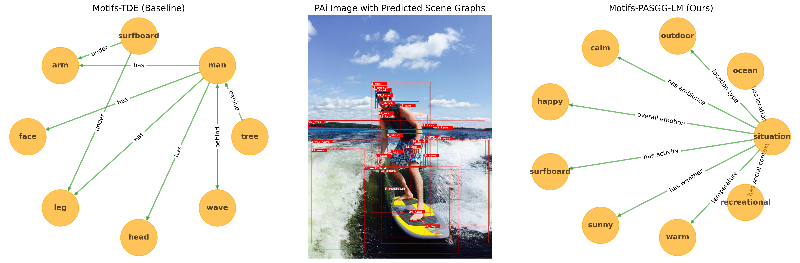

# Context-Aware Scene Graph Generation

**Official Repository for the Paper:**  
📄 *Enabling Perspective-Aware Ai with Contextual Scene Graph Generation*  
👨‍💻 Daniel Platnick\*,†, Marjan Alirezaie\*,†, Hossein Rahnama  
🏢 Flybits Labs, Toronto Metropolitan University · MIT Media Lab  
📅 Published in *Information* 2024, 15(12), 766  
🔗 [DOI: 10.3390/info15120766](https://doi.org/10.3390/info15120766)  

\* Authors contributed equally · † Correspondence: daniel.platnick [at] flybits.com

---

## 🧠 Overview

This repository introduces **Perspective-Aware Scene Graph Generation with LLM Post-Processing (PASGG-LM)**, a pipeline for the novel task of **context-aware scene graph generation (SGG)**. It enhances traditional scene graph models by post-processing their outputs with Large Language Models (LLMs), inferring deeper context such as emotion, ambience, and social context. PASGG-LM was developed to support **Perspective-Aware AI (PAi)** research.


The paper evaluates existing SGG systems such as **Motifs**, **Motifs-TDE**, and **RelTR** to highlight their limitations in supporting PAi, and then extends these frameworks to enable Context-Aware Scene Graph Generation. To evaluate existing SGG systems, we introduce a new semantic evaluation metric called the **PAi Similarity Score (PSS)** and use it to highlight the limitations of current SGG models for PAi.

---
## 🧩 Codebase Foundation and Setup

This repository builds on two well-established scene graph generation (SGG) frameworks:

- **[Scene-Graph-Benchmark.pytorch](https://github.com/KaihuaTang/Scene-Graph-Benchmark.pytorch)**
- **[RelTR](https://github.com/yrcong/RelTR)**

Both frameworks come with their own configurations and dependencies. In order to isolate their environments and avoid conflicts, please follow these steps:

1. **Create Separate Environments for SGG Frameworks:**
   - **Environment 1:** Install and configure dependencies for *Scene-Graph-Benchmark.pytorch*.
   - **Environment 2:** Install and set up dependencies for *RelTR*.
   
2. **Setup the LLM Post-Processing Environment:**
   - **Environment 3:** Create a separate environment dedicated to performing LLM-based post-processing on SGG model outputs. 
   

From the directory where environment.yml is located:
```bash
conda env create -f environment.yml
conda activate llm-postprocessing
```


3. **Switching Between Environments:**
   - When running experiments or evaluations with a specific SGG framework, activate the corresponding virtual environment (Environment 1 for Scene-Graph-Benchmark.pytorch or Environment 2 for RelTR) to ensure that the correct dependencies are used.
   - When performing LLM-based post-processing, activate Environment 3.
   - Use your environment activation command (for example, `source <env-name>/bin/activate`) to switch between these environments as needed.


Following these instructions will help keep the dependencies isolated, ensuring that experiments run smoothly without conflicts.


---

## 📁 Directory Structure


```bash
├── 📁 context-aware-sgg/
│   ├── 📁 images/
│       ├── pasgg-example-output.png
│   ├── 📁 llm-postprocessing/
│       ├── 📁 finetune-raw-data/
│       ├── 📁 finetune/
│       ├── llm_utils.py
│       ├── run_llm.py
│       ├── training_data.jsonl
│       ├── tuned_inference.py
│   ├── 📁 models/
│       ├── 📁 Scene-Graph-Benchmark.pytorch/
│       ├── 📁 reltr/
│   ├── README.MD
│   ├── environment.yml
│   ├── LICENSE
```

---

## 🤖 Example Context-Aware Scene Graph Generation





## 📑 Citing the Paper

If our work is helpful for your research, please cite our publication:
```bash
@article{platnick2024pasgg,
  title={Enabling Perspective-Aware Ai with Contextual Scene Graph Generation},
  author={Platnick, Daniel and Alirezaie, Marjan and Rahnama, Hossein},
  journal={Information},
  volume={15},
  number={12},
  pages={766},
  year={2024},
  publisher={MDPI}
}
```